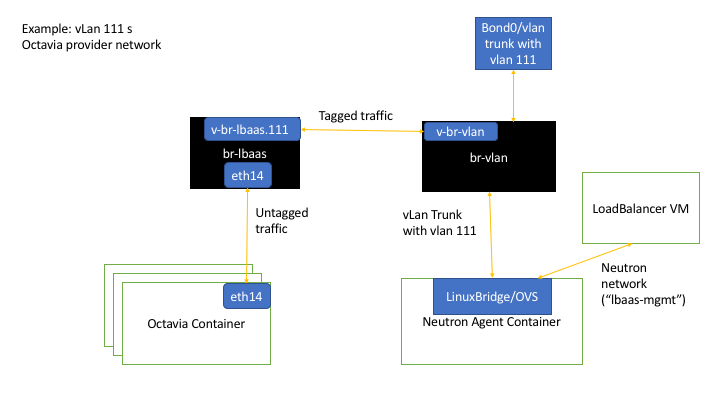

# Installation Guide

## Prerequisites

# Supported RPC-O versions
RPC-O 14.3

__Note:__ Refer to https://github.com/rcbops/rpc-octavia/blob/master/gating/scripts/vars.sh#L50 to learn which version it has been tested against.
### Check if OpenStack system is functional
* Build, destroy VMs, etc.

### Steps to prepare environment (on each host)

1. Verify VLan is connected, e.g. by pinging from one infra host to the other
2. Setup Bridge and v-eth pair (see ) The `VLAN_ID` and the CIDR after `address` can be adjusted to the local circumstances. This script will set up the br-lbaas script and create a link between br-lbaas and br-vlan in a post-up script. This ensures the link survives a reboot.

```bash
#!/bin/bash

VLAN_ID=111
cat >>/etc/network/interfaces.d/vm-bridges.cfg <<EOL
auto br-lbaas
iface br-lbaas inet static
    bridge_stp off
    bridge_waitport 0
    bridge_fd 0
    address 10.0.252.100/22
    post-up /usr/local/bin/configure_br-lbaas_veth.sh
EOL

# Create the post-up script
cat >>/usr/local/bin/configure_br-lbaas_veth.sh <<EOL
#!/bin/bash
VLAN_ID=${VLAN_ID}

# This sets up the link
ip link add v-br-vlan type veth peer name v-br-lbaas
ip link add link v-br-lbaas name v-br-lbaas.${VLAN_ID} type vlan id ${VLAN_ID}
ip link set v-br-vlan up
ip link set v-br-lbaas up
ip link set v-br-lbaas.${VLAN_ID} up
brctl addif br-lbaas v-br-lbaas.${VLAN_ID}
brctl addif br-vlan v-br-vlan
EOL

chmod +rx /usr/local/bin/configure_br-lbaas_veth.sh
ifup br-lbaas
```

3. Verify with `ip a` and `brctl show`

### Configure OSA for rpc-octavia
1. Add the new bridge to `/etc/openstack_deploy/openstack_user_config.yml` along with the `cidr_networks` and `used_ips`

Example:
```yaml
cidr_networks:
lbaas: 172.29.248.0/22

used_ips:
- "172.29.248.1,172.29.248.50"
- "172.29.248.100"

global_overrides/provider-networks…

- network:
    container_bridge: "br-lbaas"
    container_type: "veth"
    container_interface: "eth14"
    host_bind_override: "eth14"
    ip_from_q: "lbaas"
    type: "raw"
    net_name: "lbaas"
    group_binds:
        - neutron_linuxbridge_agent
        - octavia-worker
        - octavia-housekeeping
        - octavia-health-manager
```

2. Configure new network in Octavia by adding and adjusting the following values to `/etc/openstack_deploy/user_osa_variables_overrides.yml`

```yaml
# Name of the Octavia management network in Neutron
octavia_neutron_management_network_name: lbaas-mgmt

# Name of the provider net in the system
octavia_provider_network_name: vlan
octavia_provider_segmentation_id: 111

# this is the name used in openstack_user_config.yml with '_address' added
octavia_container_network_name: lbaas_address

# Network type
octavia_provider_network_type: vlan

# Network CIDR
octavia_management_net_subnet_cidr: 10.0.252.0/22
```

3. Setup the Octavia container configuration in `/etc/openstack_deploy/conf.d/octavia.yml`. Verify volume groups (e.g. `vmvg00`) by running `vgscan` on all infra hosts. Similarly, verify ip addresses for each infra hosts with `ip a` if needed.

Example:
```yaml
---

octavia-infra_hosts:
  infra1:
    ip: 10.0.236.100
    container_vars:
      lxc_container_vg_name: vmvg00
  infra2:
    ip: 10.0.236.101
    container_vars:
      lxc_container_vg_name: vmvg00
  infra3:
    ip: 10.0.236.102
    container_vars:
      lxc_container_vg_name: vmvg00
```

## Install Octavia
1. Clone the rpc-octavia repo by running: `cd /opt && git clone https://github.com/rcbops/rpc-octavia.git`

2. Run the Octavia install script: `cd /opt/rpc-octavia && ./scripts/deploy.sh`

3. Download amphora image from `http://rpc-repo.rackspace.com//images/amphora/r14.3.0/` - this image is built nightly, tested, and of the test passes uploaded.

6.4 Install the image by running in the service tenant by ensuring the `OS_PROJECT_ID` is set to the GUID from the service project (the octavia user belongs per default to the servcie tenant): `openstack image create --file  <image-name> --disk-format qcow2 --tag octavia-amphora-image --private`

## Verify Octavia install by creating a load balancer

1. Attach to the utility container and source an openrc
2. If needed install the Octavia CLI: `pip install -isolated python-octaviaclient`
3. Create a load balancer: `openstack loadbalancer create --name test-lb --vip-network-id GATEWAY_NET`
4. Repeat `openstack loadbalancer list` until the loadbalancer becomes "ACTIVE"
5. Create Listener:  `openstack loadbalancer listener create --name test-listener --protocol HTTP --protocol-port 80 test-lb`
6. Check if it works: `curl -s -o /dev/null -w "%{http_code}" http://$(openstack loadbalancer show test-lb -c vip_address -f value)` This should return 503

## Troubleshotting Tips
### Verify Octavia provider network works
Octavia uses very restrictive security group settings on the vm and very restrictive iptables settings on the container so diagnosing network issues is challenging. That said here are some things to test:
* ping br-lbaas from the Ocatvia container. This should show "normal" ping output
* ping br-vlan from the Octavia container. This should show "normal" ping output
* ping an Octavia container ona  different host. This should show ping timeout errors. Verify with `arp -n`if the Mac address of the other container shows
* Verify the neutron side:
    * `openstack network show lbaas-mgmt` verify the vLan id, network type, etc.
    * `openstack network show lbaas-mgmt-subnet` verify ip allocation pool (should not overlap with existing ips)
    * Verify connectivity between neutron on different hosts:
        1. Attach to the neutron-agents container on one host
        2. `ip netns list` take note of the first dhcp server's namespace name
        4. `ip netns exec <first dhcp namespace> ip addr` and note the IP address
        3. In a new window connect to a different host's neutron-agent container
        4. By following step 2 find the corresponding dhcp server namespace
        5. `ip netns exec <first dhcp namespace> ping <ip from other dhcp server` this should show normal ping output. If not advanced troubleshooting with `tcpdump`, etc. is needed - so better escalate
